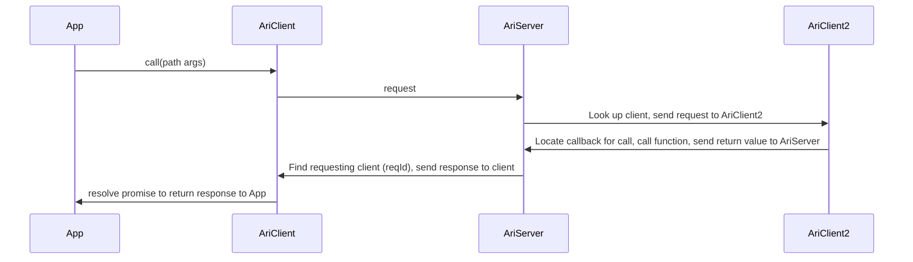

__ARI__ 3
=
ARI =  Automation Routing Infrastructure

A framework for creating systems of connected clients allowing theese to 
* Provide and call functions 
* Synchronize state

# Design

Design parts:
1. Schema: A well defined chema for the common object stores (clients and server).
2. AriNodeBase class: Client local helper classes to enforce the schema and provide an interface to client applications.
3. AriClient class: Synchronization of client state to server.
4. AriServer: Single server instance, synchronizing automation (state and communication) among clients.

## 1. Schema
* All "objects" represented by the system MUST adhere to following (1'st level) schema:
```javascript
let ariObject = {
    __parent: null,         // Pointer to parent object, or null (if root element) 
    name: "NameOfObject",   // Name of the object -  unique to all children of the parent object
    description?: "...",    // Description of object
    ins?: {},               // Input definitions for object
    outs?: {},              // Output definitions for object
    calls?: {},             // Call definitions for object
    children?: {}           // Children definitions for object
}
```
* *Data only relevant in local scope (local process) is prefixed with double underscore "__"
* Members with ? after the name are optional

```javascript
ariObject.ins = {
    in1: {
        __parent: ...,          // Pointer to parent object
        name: "in1",            // Unique name of the input
        description?: "...",    // Description of input
        __cb: null              // Ref to function to be called when input is set
    }, ...
}
```
```javascript
ariObject.outs = {
    out1: {
        __parent: ...,          // Pointer to parent object
        name: "out1",           // Unique name of the input
        description?: "...",    // Description of output
        v: 42                   // Latest value of output
        ts?: "2019-01-01T00:00:00.000Z" // Timestamp in ISO date format
    }, ...
}
```
```javascript
ariObject.calls = {
    call1: {
        __parent: ...,          // Pointer to parent object
        name: "call1",          // Unique name of the function
        description?: "...",    // Description of call, parameters, etc.
        __cb: null              // Ref to _async_ function to be called
    }
}
```
```javascript
ariObject.children = {
    child1: ...,                // AriOjbject definition
    ,...                        // further AriOjbject definitions
}
```

## AriNodeBase
Client local helper class system to enforce the schema and provide an interface to client applications.

The main class provides an API to allow 
* creating an AriNode
* Adding and defining inputs, outputs, calls and child AriNodes

## AriClient class: 
* Send action to local or remote AriNode Tree
  * Actions can be:
* Synchronization of client state to server.

### API:
* __call__ remote/local function
* __on__ Get notified on any update of an output
* __watch__ remote/local output for updates
* __set__ remote/local input

```javascript
ariClient.onCall("/call1", (v)=>{...})

async ariClient.call("/localObject/call1", args)
async ariClient.call("remoteObject/call1", args)


ariClient.on("remoteObject/call1", (v)=>{...})

ariClient.watch("remoteObject/call1", (jsonPatch)=>{...})

ariClient.set("remoteObject/call1", (v)=>{...})

```

### Flows:
#### call - Client requests a call on another client
```javascript
AriClient2.onCall("call1", (args)=>{return args+1})
AriClient.call("AriClient1:call1", 42)
```


#### setOut/onOut
A class system is provided to help generate the required schema.
This class system consists of a main class calle AriNode.
AriNode has following main helper functiuons:

#### setIn/onIn
#### watch / unwatch
